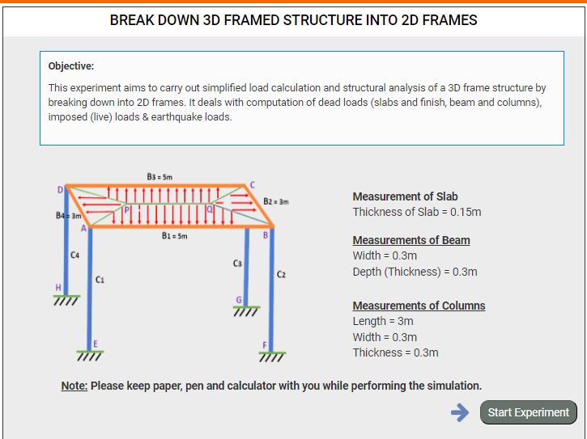
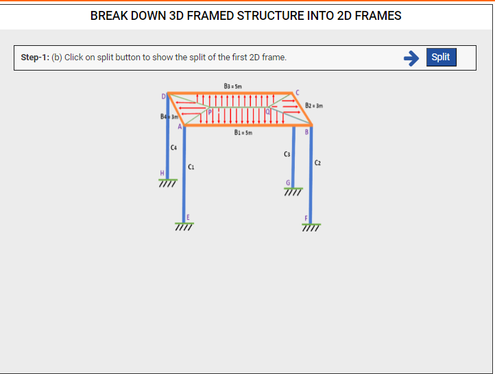
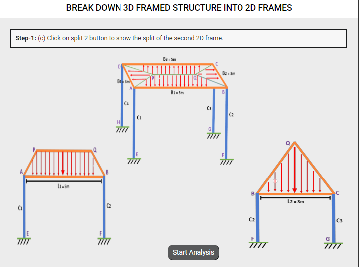
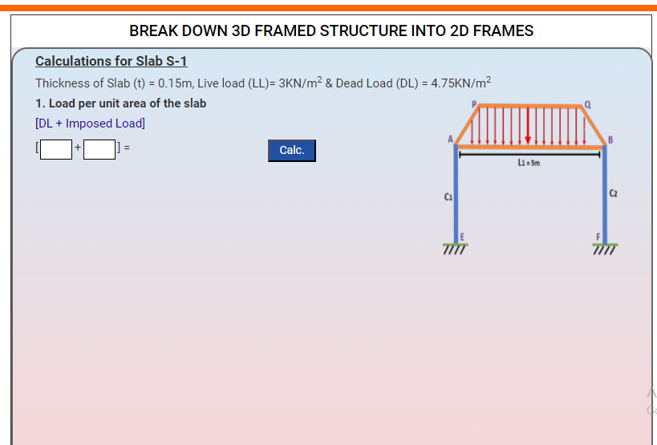
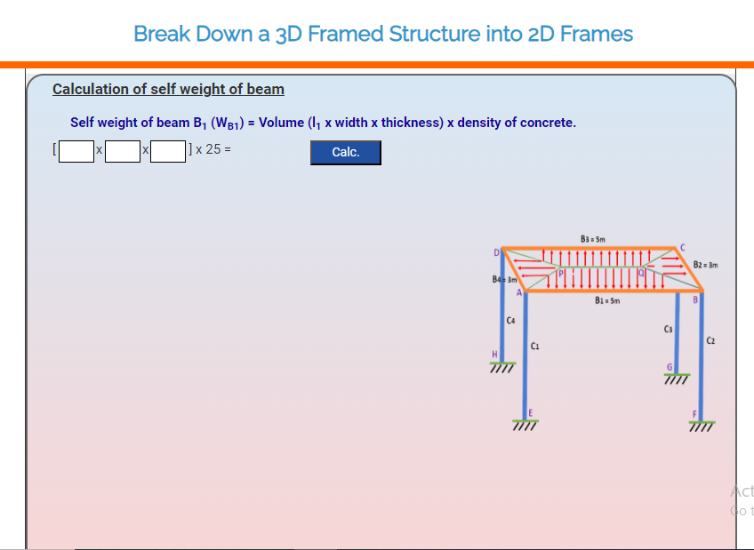
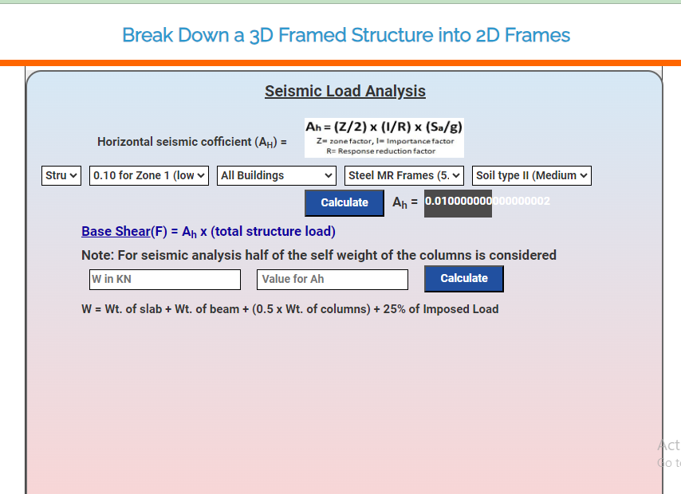

### These steps will be followed for the experiment

1. Click on start experiment button to start the experiment.

Step-1: (a) Click on 'Split' button to split the 3D frame into 2D .

Step-1: (b) Click on 'Start Analysis' button to initiate the analysis.

Step-2: Calculation of slab load for trapezoidal and triangular section.

Step-3: Calculation of self weight of beams and columns.

Step-3: Calculation for seismic load analysis. 

