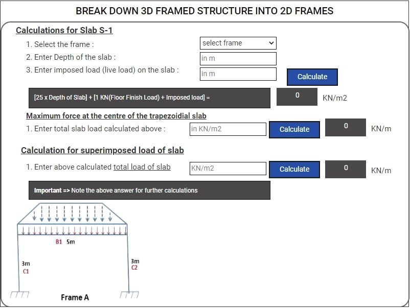
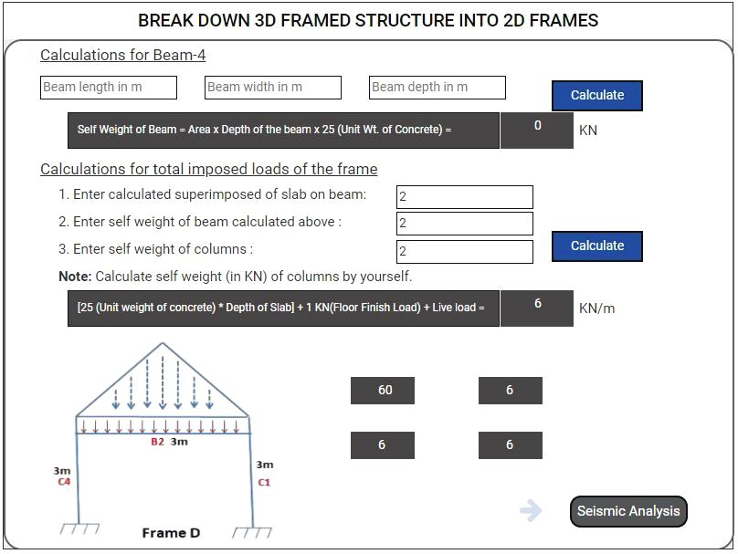
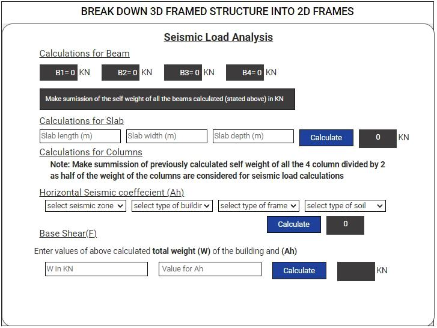

### These steps will be followed for the experiment

1. Click on start experiment button to start the experiment.

Step-1: (a) Click on 'Bring' button to bring the 3D frame .

Step-1: (b) Click on 'Split' button to split the 3D frame into 2D.

Step-1: (c) Click on 'start analysis' button to start the analysis of the 2D frames.

Step-2: (a) Perform the calculations for 2D frame 'A'.

Step-3: Click on 'Analyse Frame 2' button to perform calculation for 2D frame 2 & similarly carry out the same procedure for frame 3 & 4. 

Step-4: (a) Click on 'Seismic Analysis' button to carry out Seismic Load Analysis of the Frame.

Step-4: (b) Carry out Seismic load Analysis and determine the Base Shear.

