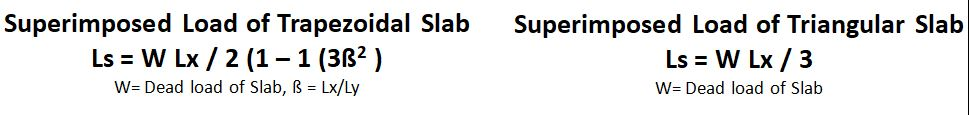
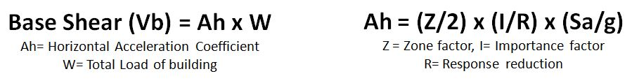

### Theory

This virtual experiment aims to simulate the applicatio of suposition for the combination of loads in a framed structure, from one member of the frame to another in a sequence of arrangement, as shown in figure (1) the loads can be transfered from slabs to beams, beams to columns & columns to footings and the load calculations can be done by simulational disassembling of a 3D structural frame into 4 differential 2D frame units.

The experimental calculation involves: 
Step-1: Calculation of total load of slab involving Dead load + Live Load + Floor finish load. 
Step-2: Calculation of superimposed load of slab to beams. 
Step-3: calculation of self weight of beam. 
step-4: Calculation of total imposed load of the frame to footing (superimposed Slab load + self     weight of Beam + self weight of column). 

The superimposed load from slab to beams can be calculated by a standerd formula shown below in  the fig(1) 
&nbsp;&nbsp;&nbsp;&nbsp;&nbsp;&nbsp;&nbsp;&nbsp;&nbsp;

Fig. 1 formula 1

The user may calculate the ultimate superimposed load of different units of the frame and the summition of loads of all the 2D frames can give the total imposed load of 3D structure which can transfered to the base, after which the user may calculate the seismic load of the building by using the standard base shear formula shown in the fig. (2).

    
    
    Fig. 2 formula 2
    

